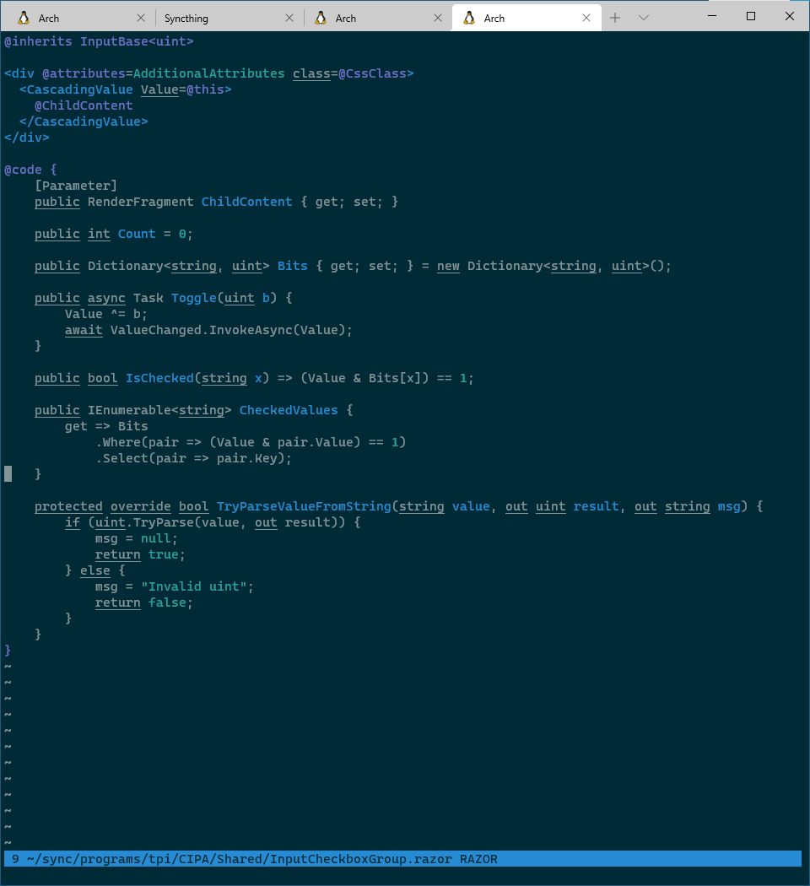

# vim-razor

## Description

This plugin provides syntax highlighting and indentation for [Razor](https://docs.microsoft.com/en-us/aspnet/core/mvc/views/razor) markup files. Out of the box, it detects `*.cshtml` and `*.razor` file extensions.

This plugin is likely incomplete in its current state, but it is already better than any other Razor plugin I've found. I will continue to update it as I learn more about Razor.

## Configuration

`g:razor_indent_shiftwidth`:
* If defined, overrides `shiftwidth` for C# lines; this is useful if you want HTML and C# to be indented differently.

`g:razor_fold`:
* If defined, Razor blocks will be folded.
